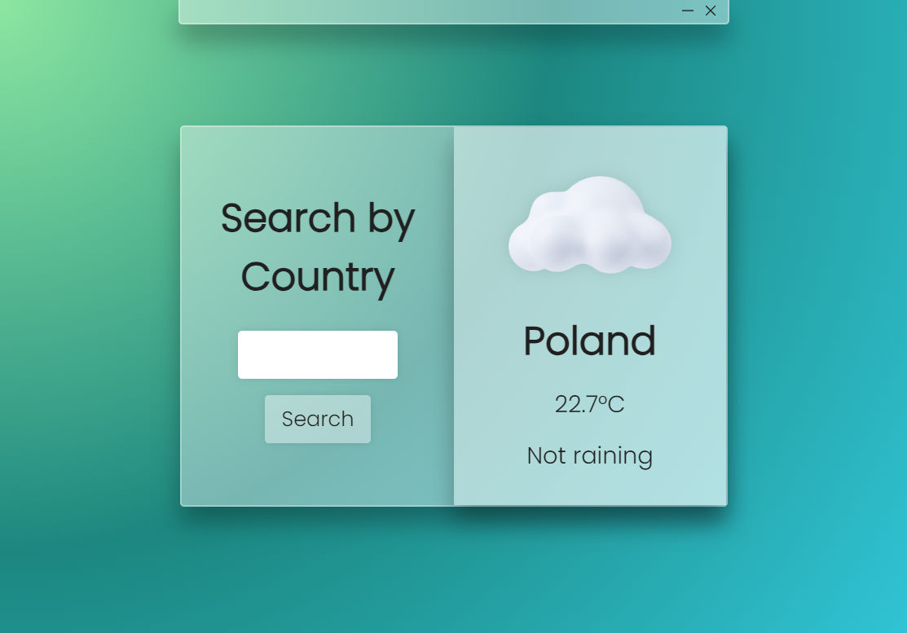

# Weather App

A simple weather application built using electron.js framework

## Demo


## Usage

### 1. Install electron.js
```bash
npm install electron
```

### 2. Run the project
```bash
npm install 
```